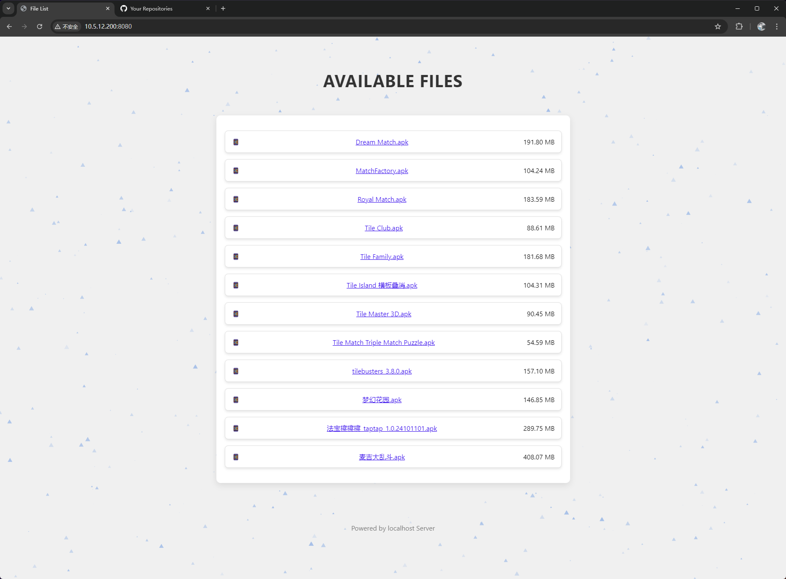
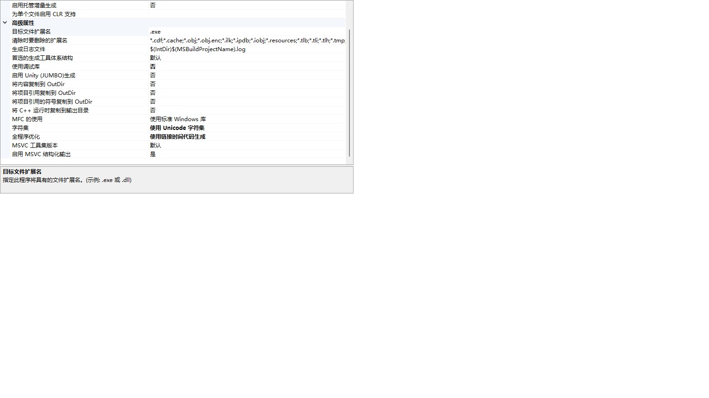
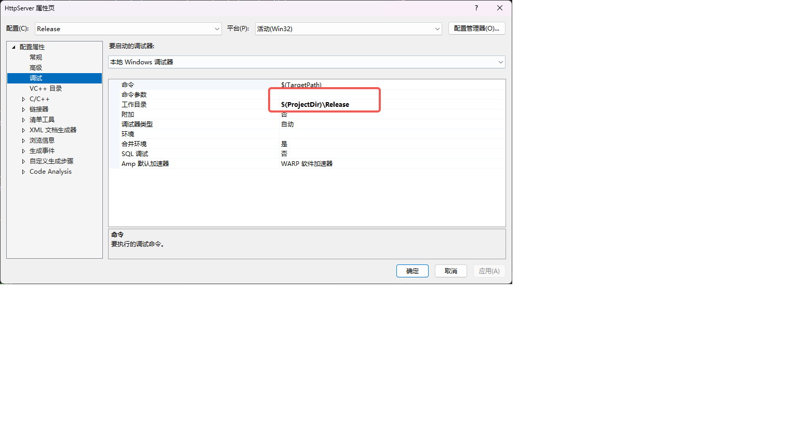
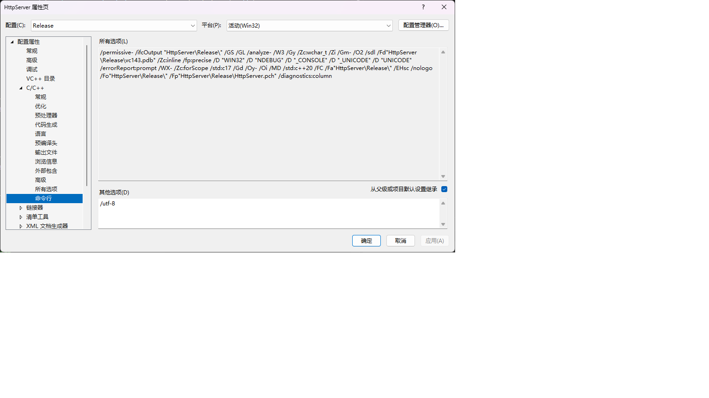
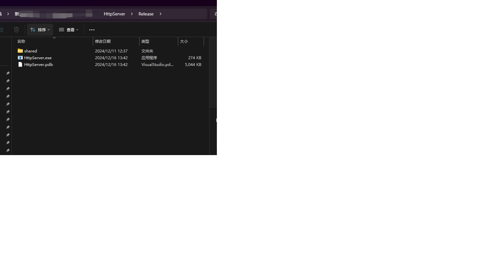

# 项目初始化

## 项目配置 
> 切记要配好 以下环境，不然读取中文名路径的文件的时候 会踩坑

1. 字符集更改为 Unicode

2. 工作目录设置为 $(ProjectDir)\Release

3. 命令行配置

## 文件根目录
将文件放入shared中， html放在根目录下  命名index.html
需要下载的文件 放到bin目录下

# 可执行文件
> 直接下载可执行exe, 不需要关心环境配置
https://github.com/badApple001/HttpServer/releases/tag/1.0.0